# Diagrama de Arquitectura de Alto Nivel
## Sistema de Gestión de Tesis e Informes de Tesis - UNT

```mermaid
graph TB
    subgraph "Capa de Presentación"
        WEB[Web Application<br/>Next.js 14+]
        MOBILE[Mobile Application<br/>React Native]
    end

    subgraph "Capa de API Gateway"
        GATEWAY[API Gateway<br/>NestJS + Rate Limiting<br/>Load Balancer]
    end

    subgraph "Capa de Servicios - Microservicios"
        AUTH[Servicio de Autenticación<br/>JWT + OAuth2 + RBAC]
        USUARIOS[Servicio de Usuarios<br/>Gestión de Perfiles]
        PROYECTOS[Servicio de Proyectos de Tesis<br/>Workflow Engine]
        INFORMES[Servicio de Informes de Tesis<br/>Versionado + Storage]
        TITULACION[Servicio de Titulación<br/>Sustentaciones + Jurados]
        ANALITICAS[Servicio de Analíticas<br/>KPIs + Reportes]
        NOTIFICACIONES[Servicio de Notificaciones<br/>Email + Push]
        DOCUMENTOS[Servicio de Documentos<br/>PDF Generation]
        PLAGIO[Servicio de Verificación de Plagio<br/>Integración Turnitin]
        REPOSITORIO[Servicio de Repositorio<br/>DSpace Integration]
        COLABORACION[Servicio de Colaboración<br/>Socket.io Real-time]
    end

    subgraph "Capa de Datos"
        POSTGRES[(PostgreSQL<br/>Base de Datos Principal)]
        REDIS[(Redis<br/>Caché + Sessions)]
        MINIO[(MinIO/AWS S3<br/>Almacenamiento de Documentos)]
    end

    subgraph "Servicios Externos"
        ORCID[ORCID API]
        EMAIL[SMTP/SendGrid]
        FIRMA[Firma Digital<br/>Certificados]
        ZOTERO[Zotero/Mendeley API]
        BLOCKCHAIN[Blockchain<br/>Certificación]
    end

    subgraph "Seguridad"
        JWT[JWT Tokens]
        OAUTH[OAuth2 Provider]
        RBAC[RBAC System]
        ENCRYPTION[Encryption at Rest]
    end

    %% Conexiones
    WEB --> GATEWAY
    MOBILE --> GATEWAY
    
    GATEWAY --> AUTH
    GATEWAY --> USUARIOS
    GATEWAY --> PROYECTOS
    GATEWAY --> INFORMES
    GATEWAY --> TITULACION
    GATEWAY --> ANALITICAS
    GATEWAY --> NOTIFICACIONES
    GATEWAY --> DOCUMENTOS
    GATEWAY --> PLAGIO
    GATEWAY --> REPOSITORIO
    GATEWAY --> COLABORACION
    
    AUTH --> POSTGRES
    AUTH --> REDIS
    USUARIOS --> POSTGRES
    PROYECTOS --> POSTGRES
    PROYECTOS --> REDIS
    INFORMES --> POSTGRES
    INFORMES --> MINIO
    TITULACION --> POSTGRES
    TITULACION --> DOCUMENTOS
    ANALITICAS --> POSTGRES
    ANALITICAS --> REDIS
    NOTIFICACIONES --> REDIS
    DOCUMENTOS --> MINIO
    PLAGIO --> MINIO
    REPOSITORIO --> MINIO
    COLABORACION --> REDIS
    
    NOTIFICACIONES --> EMAIL
    TITULACION --> FIRMA
    REPOSITORIO --> ORCID
    REPOSITORIO --> ZOTERO
    TITULACION --> BLOCKCHAIN
    
    AUTH --> JWT
    AUTH --> OAUTH
    AUTH --> RBAC
    POSTGRES --> ENCRYPTION
    
    %% Estilos
    classDef frontend fill:#e1f5ff,stroke:#01579b,stroke-width:3px
    classDef gateway fill:#fff3e0,stroke:#e65100,stroke-width:3px
    classDef service fill:#f3e5f5,stroke:#4a148c,stroke-width:2px
    classDef database fill:#e8f5e9,stroke:#1b5e20,stroke-width:3px
    classDef external fill:#fce4ec,stroke:#880e4f,stroke-width:2px
    classDef security fill:#fff8e1,stroke:#f57f17,stroke-width:2px
    
    class WEB,MOBILE frontend
    class GATEWAY gateway
    class AUTH,USUARIOS,PROYECTOS,INFORMES,TITULACION,ANALITICAS,NOTIFICACIONES,DOCUMENTOS,PLAGIO,REPOSITORIO,COLABORACION service
    class POSTGRES,REDIS,MINIO database
    class ORCID,EMAIL,FIRMA,ZOTERO,BLOCKCHAIN external
    class JWT,OAUTH,RBAC,ENCRYPTION security
```

## Descripción de Componentes

### Capa de Presentación
- **Web Application**: Next.js 14+ con App Router, TypeScript, TailwindCSS
- **Mobile Application**: React Native con Expo, navegación React Navigation

### Capa de API Gateway
- **API Gateway**: NestJS con rate limiting, load balancing, routing
- Autenticación centralizada
- Logging y monitoreo
- CORS y seguridad

### Capa de Servicios
Arquitectura de microservicios con comunicación REST/gRPC:

1. **Servicio de Autenticación**: JWT, OAuth2, refresh tokens, RBAC
2. **Servicio de Usuarios**: Gestión de perfiles, roles, permisos
3. **Servicio de Proyectos de Tesis**: Workflow engine, estados, asesorías
4. **Servicio de Informes de Tesis**: Versionado, storage, comparación
5. **Servicio de Titulación**: Sustentaciones, jurados, actas
6. **Servicio de Analíticas**: KPIs, reportes, dashboards
7. **Servicio de Notificaciones**: Email, push, in-app
8. **Servicio de Documentos**: Generación PDF, templates
9. **Servicio de Verificación de Plagio**: Integración Turnitin
10. **Servicio de Repositorio**: DSpace integration
11. **Servicio de Colaboración**: Socket.io real-time editing

### Capa de Datos
- **PostgreSQL**: Base de datos relacional principal
- **Redis**: Caché, sessions, pub/sub para real-time
- **MinIO/AWS S3**: Almacenamiento de documentos

### Servicios Externos
- **ORCID**: Identificación de investigadores
- **SMTP/SendGrid**: Envío de emails
- **Firma Digital**: Certificados digitales para actas
- **Zotero/Mendeley**: Gestión bibliográfica
- **Blockchain**: Certificación de documentos

### Seguridad
- **JWT Tokens**: Autenticación stateless
- **OAuth2**: Integración con proveedores externos
- **RBAC**: Control de acceso basado en roles
- **Encryption at Rest**: Encriptación de datos sensibles
