# Modelo de Datos Relacional - Diagrama ER
## Sistema de Gestión de Tesis e Informes de Tesis - UNT

```mermaid
erDiagram
    %% Entidades Principales
    USUARIOS ||--o{ ESTUDIANTES : "tiene"
    USUARIOS ||--o{ ASESORES : "tiene"
    USUARIOS ||--o{ JURADOS : "tiene"
    USUARIOS ||--o{ HISTORIAL_CAMBIOS : "realiza"
    
    ROLES ||--o{ USUARIOS : "asignado a"
    
    %% Proyectos de Tesis
    ESTUDIANTES ||--o{ PROYECTOS_TESIS : "inscribe"
    ASESORES ||--o{ PROYECTOS_TESIS : "asesora"
    PROYECTOS_TESIS ||--o{ ASESORIAS : "tiene"
    PROYECTOS_TESIS ||--o{ INFORMES_TESIS : "genera"
    
    %% Informes de Tesis
    INFORMES_TESIS ||--o{ DOCUMENTOS : "tiene"
    DOCUMENTOS ||--o{ VERSIONES_DOCUMENTO : "versiona"
    VERSIONES_DOCUMENTO ||--o{ HISTORIAL_CAMBIOS : "registra"
    
    %% Sustentaciones
    INFORMES_TESIS ||--o{ SUSTENTACIONES : "requiere"
    JURADOS ||--o{ JURADOS_SUSTENTACION : "participa en"
    SUSTENTACIONES ||--o{ JURADOS_SUSTENTACION : "evaluada por"
    SUSTENTACIONES ||--o{ EVALUACIONES : "tiene"
    
    %% Notificaciones
    USUARIOS ||--o{ NOTIFICACIONES : "recibe"
    
    %% Configuración
    CONFIGURACION_REGLAMENTO ||--o{ ESTADOS_FLUJO : "define"
    CONFIGURACION_REGLAMENTO ||--o{ TIPOS_DOCUMENTO : "define"
    
    %% Definición de Entidades
    USUARIOS {
        UUID id PK
        VARCHAR correo_institucional UK
        VARCHAR contrasena_hash
        VARCHAR nombres
        VARCHAR apellido_paterno
        VARCHAR apellido_materno
        VARCHAR dni
        VARCHAR telefono
        BOOLEAN activo
        TIMESTAMP_WITH_TIME_ZONE ultimo_acceso
        TIMESTAMP_WITH_TIME_ZONE creado_en
        TIMESTAMP_WITH_TIME_ZONE actualizado_en
        UUID creado_por FK
        UUID actualizado_por FK
    }
    
    ROLES {
        UUID id PK
        VARCHAR nombre UK
        VARCHAR descripcion
        JSONB permisos
        TIMESTAMP_WITH_TIME_ZONE creado_en
        TIMESTAMP_WITH_TIME_ZONE actualizado_en
    }
    
    ESTUDIANTES {
        UUID id PK
        UUID usuario_id FK
        VARCHAR codigo_estudiante UK
        VARCHAR programa_estudios
        VARCHAR facultad
        DATE fecha_ingreso
        DATE fecha_egreso_estimada
        VARCHAR orcid_id
        JSONB datos_academicos
        TIMESTAMP_WITH_TIME_ZONE creado_en
        TIMESTAMP_WITH_TIME_ZONE actualizado_en
        UUID creado_por FK
        UUID actualizado_por FK
    }
    
    ASESORES {
        UUID id PK
        UUID usuario_id FK
        VARCHAR codigo_docente UK
        VARCHAR categoria
        VARCHAR departamento
        VARCHAR area_investigacion
        INTEGER carga_academica_actual
        INTEGER tesis_dirigidas
        VARCHAR orcid_id
        JSONB datos_investigacion
        TIMESTAMP_WITH_TIME_ZONE creado_en
        TIMESTAMP_WITH_TIME_ZONE actualizado_en
        UUID creado_por FK
        UUID actualizado_por FK
    }
    
    JURADOS {
        UUID id PK
        UUID usuario_id FK
        VARCHAR codigo_docente UK
        VARCHAR especialidad
        BOOLEAN es_doctor
        INTEGER sustentaciones_participadas
        JSONB datos_jurado
        TIMESTAMP_WITH_TIME_ZONE creado_en
        TIMESTAMP_WITH_TIME_ZONE actualizado_en
        UUID creado_por FK
        UUID actualizado_por FK
    }
    
    PROYECTOS_TESIS {
        UUID id PK
        UUID estudiante_id FK
        UUID asesor_id FK
        VARCHAR titulo
        TEXT resumen
        TEXT problema_investigacion
        TEXT objetivos
        TEXT justificacion
        VARCHAR area_investigacion
        VARCHAR estado
        INTEGER cambios_asesor
        DATE fecha_inscripcion
        DATE fecha_aprobacion
        DATE fecha_conformidad_asesor
        JSONB metadatos
        TIMESTAMP_WITH_TIME_ZONE creado_en
        TIMESTAMP_WITH_TIME_ZONE actualizado_en
        UUID creado_por FK
        UUID actualizado_por FK
    }
    
    ASESORIAS {
        UUID id PK
        UUID proyecto_tesis_id FK
        UUID asesor_id FK
        DATE fecha_asesoria
        TEXT observaciones
        TEXT recomendaciones
        VARCHAR tipo
        INTEGER duracion_minutos
        JSONB detalles
        TIMESTAMP_WITH_TIME_ZONE creado_en
        TIMESTAMP_WITH_TIME_ZONE actualizado_en
        UUID creado_por FK
        UUID actualizado_por FK
    }
    
    INFORMES_TESIS {
        UUID id PK
        UUID proyecto_tesis_id FK
        VARCHAR titulo
        TEXT resumen
        VARCHAR estado
        INTEGER revisiones_asesor
        FLOAT porcentaje_similitud
        DATE fecha_inicio
        DATE fecha_conformidad
        JSONB metadatos
        TIMESTAMP_WITH_TIME_ZONE creado_en
        TIMESTAMP_WITH_TIME_ZONE actualizado_en
        UUID creado_por FK
        UUID actualizado_por FK
    }
    
    DOCUMENTOS {
        UUID id PK
        UUID informe_tesis_id FK
        VARCHAR nombre
        VARCHAR tipo
        VARCHAR ruta_archivo
        BIGINT tamano_bytes
        VARCHAR mime_type
        VARCHAR estado
        JSONB metadatos
        TIMESTAMP_WITH_TIME_ZONE creado_en
        TIMESTAMP_WITH_TIME_ZONE actualizado_en
        UUID creado_por FK
        UUID actualizado_por FK
    }
    
    VERSIONES_DOCUMENTO {
        UUID id PK
        UUID documento_id FK
        VARCHAR numero_version
        VARCHAR ruta_archivo
        BIGINT tamano_bytes
        TEXT comentario
        VARCHAR estado
        JSONB metadatos
        TIMESTAMP_WITH_TIME_ZONE creado_en
        UUID creado_por FK
    }
    
    HISTORIAL_CAMBIOS {
        UUID id PK
        UUID version_documento_id FK
        UUID usuario_id FK
        VARCHAR tipo_cambio
        TEXT descripcion
        JSONB valor_anterior
        JSONB valor_nuevo
        TIMESTAMP_WITH_TIME_ZONE creado_en
    }
    
    SUSTENTACIONES {
        UUID id PK
        UUID informe_tesis_id FK
        VARCHAR estado
        DATE fecha_programada
        TIME hora_programada
        VARCHAR lugar
        VARCHAR numero_resolucion
        DATE fecha_resolucion
        FLOAT nota_final
        VARCHAR resultado
        JSONB metadatos
        TIMESTAMP_WITH_TIME_ZONE creado_en
        TIMESTAMP_WITH_TIME_ZONE actualizado_en
        UUID creado_por FK
        UUID actualizado_por FK
    }
    
    JURADOS_SUSTENTACION {
        UUID id PK
        UUID sustentacion_id FK
        UUID jurado_id FK
        VARCHAR rol
        BOOLEAN asistio
        TEXT observaciones
        TIMESTAMP_WITH_TIME_ZONE creado_en
        TIMESTAMP_WITH_TIME_ZONE actualizado_en
    }
    
    EVALUACIONES {
        UUID id PK
        UUID sustentacion_id FK
        UUID jurado_id FK
        FLOAT criterio_1
        FLOAT criterio_2
        FLOAT criterio_3
        FLOAT criterio_4
        FLOAT nota_total
        TEXT comentarios
        TIMESTAMP_WITH_TIME_ZONE creado_en
        UUID creado_por FK
    }
    
    NOTIFICACIONES {
        UUID id PK
        UUID usuario_id FK
        VARCHAR tipo
        VARCHAR titulo
        TEXT mensaje
        VARCHAR canal
        BOOLEAN leida
        DATE fecha_lectura
        JSONB metadatos
        TIMESTAMP_WITH_TIME_ZONE creado_en
    }
    
    CONFIGURACION_REGLAMENTO {
        UUID id PK
        VARCHAR clave UK
        TEXT valor
        TEXT descripcion
        VARCHAR tipo
        TIMESTAMP_WITH_TIME_ZONE creado_en
        TIMESTAMP_WITH_TIME_ZONE actualizado_en
    }
    
    ESTADOS_FLUJO {
        UUID id PK
        UUID configuracion_id FK
        VARCHAR entidad
        VARCHAR estado
        VARCHAR estado_siguiente
        TEXT descripcion
        INTEGER orden
        TIMESTAMP_WITH_TIME_ZONE creado_en
    }
    
    TIPOS_DOCUMENTO {
        UUID id PK
        UUID configuracion_id FK
        VARCHAR codigo UK
        VARCHAR nombre
        TEXT descripcion
        BOOLEAN obligatorio
        VARCHAR formato
        BIGINT tamano_maximo
        TIMESTAMP_WITH_TIME_ZONE creado_en
    }
    
    %% Relaciones
    USUARIOS {
        UUID rol_id FK
    }
    
    %% Índices Recomendados
    %% USUARIOS: idx_usuarios_correo, idx_usuarios_dni, idx_usuarios_activo
    %% ESTUDIANTES: idx_estudiantes_codigo, idx_estudiantes_programa
    %% ASESORES: idx_asesores_codigo, idx_asesores_area, idx_asesores_carga
    %% PROYECTOS_TESIS: idx_proyectos_estudiante, idx_proyectos_asesor, idx_proyectos_estado
    %% ASESORIAS: idx_asesorias_proyecto, idx_asesorias_fecha
    %% INFORMES_TESIS: idx_informes_proyecto, idx_informes_estado
    %% DOCUMENTOS: idx_documentos_informe, idx_documentos_tipo
    %% VERSIONES_DOCUMENTO: idx_versiones_documento
    %% SUSTENTACIONES: idx_sustentaciones_informe, idx_sustentaciones_estado, idx_sustentaciones_fecha
    %% NOTIFICACIONES: idx_notificaciones_usuario, idx_notificaciones_leida, idx_notificaciones_tipo
```

## Descripción de Entidades y Relaciones

### Entidades de Identidad y Acceso
- **USUARIOS**: Tabla principal de usuarios del sistema
- **ROLES**: Define roles del sistema (estudiante, asesor, jurado, coordinador, decano, administrador)
- **ESTUDIANTES**: Extensión de usuarios para estudiantes de posgrado
- **ASESORES**: Extensión de usuarios para docentes asesores
- **JURADOS**: Extensión de usuarios para jurados de sustentación

### Entidades de Gestión de Tesis
- **PROYECTOS_TESIS**: Proyectos de investigación de tesis
- **ASESORIAS**: Registro de sesiones de asesoría
- **INFORMES_TESIS**: Informes finales de tesis vinculados a proyectos

### Entidades de Documentación
- **DOCUMENTOS**: Documentos asociados a informes
- **VERSIONES_DOCUMENTO**: Control de versiones de documentos
- **HISTORIAL_CAMBIOS**: Auditoría de cambios en versiones

### Entidades de Titulación
- **SUSTENTACIONES**: Programación y ejecución de sustentaciones
- **JURADOS_SUSTENTACION**: Asignación de jurados a sustentaciones
- **EVALUACIONES**: Calificaciones de jurados con rúbrica

### Entidades de Sistema
- **NOTIFICACIONES**: Sistema de notificaciones a usuarios
- **CONFIGURACION_REGLAMENTO**: Parámetros configurables del reglamento
- **ESTADOS_FLUJO**: Definición de workflows de estados
- **TIPOS_DOCUMENTO**: Catálogo de tipos de documentos requeridos

## Campos de Auditoría
Todas las tablas principales incluyen:
- `creado_en`: TIMESTAMP WITH TIME ZONE - Fecha de creación
- `actualizado_en`: TIMESTAMP WITH TIME ZONE - Fecha de última actualización
- `creado_por`: UUID - ID del usuario que creó el registro
- `actualizado_por`: UUID - ID del usuario que actualizó el registro

## Índices Recomendados

### Índices de Búsqueda
- `idx_usuarios_correo` en `usuarios(correo_institucional)`
- `idx_usuarios_dni` en `usuarios(dni)`
- `idx_estudiantes_codigo` en `estudiantes(codigo_estudiante)`
- `idx_asesores_area` en `asesores(area_investigacion)`
- `idx_proyectos_estado` en `proyectos_tesis(estado)`
- `idx_sustentaciones_fecha` en `sustentaciones(fecha_programada)`

### Índices de Rendimiento
- `idx_asesorias_proyecto` en `asesorias(proyecto_tesis_id)`
- `idx_documentos_informe` en `documentos(informe_tesis_id)`
- `idx_notificaciones_usuario` en `notificaciones(usuario_id, leida)`
- `idx_versiones_documento` en `versiones_documento(documento_id)`

## Constraints Importantes
- **UNIQUE**: correo_institucional, dni en usuarios; codigo_estudiante en estudiantes
- **CHECK**: cambios_asesor <= 3 en proyectos_tesis; revisiones_asesor <= 3 en informes_tesis
- **FOREIGN KEY**: Todas las relaciones están properly constrained
- **NOT NULL**: Campos críticos marcados como obligatorios
